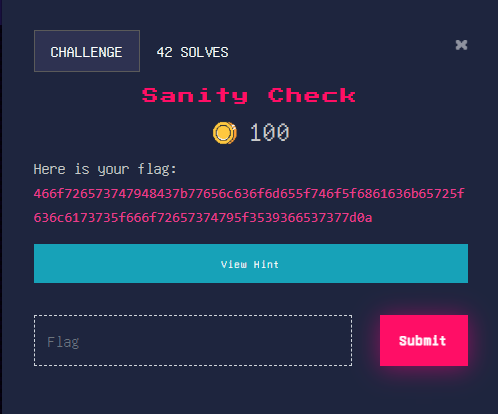

# **SANITY CHECK**
Sanity check adalah proses pemeriksaan dan validasi awal terhadap input atau data untuk memastikan bahwa input tersebut memenuhi persyaratan dasar atau logika yang diharapkan. Sanity check digunakan untuk memverifikasi apakah input atau data tersebut masuk akal, konsisten, atau valid sebelum melanjutkan ke langkah-langkah atau pemrosesan selanjutnya.
## **About the challenge**
Pada Challenge kali ini, Probleset tanpa basa basi langsung memberikan flag nya akan tetapi masih dalam bentuk enkrip code, sehingga meminta 
para pemain mendekrip code tersebut untuk dapat melihat flagnya.


## **Solution**
- Perhatikan flag yang diberikan (probleset nya baik sekali langsung ngasih flag nya :)
- Flag yang dipakai ternyata sudah dienkripsi menggunakan Hexadesimal
- Buka Website Cyberchef
```
https://gchq.github.io/CyberChef/
```
- Klik tombol magic wand tool ( kayak photoshop tools gitu bentuknya )
- And We got flag
```
ForestyHC{welcome_to_hacker_class_foresty_596e77}
```
